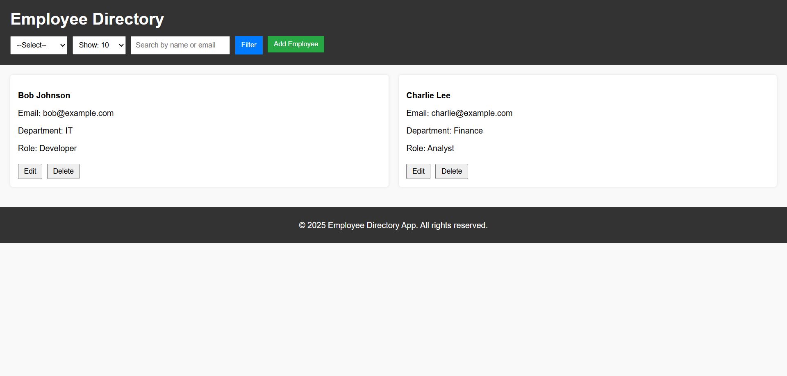

## Employee Directory

**Frontend Assignment**  
Built with HTML, CSS, JS (Vanilla).

## Features
- Employee listing (Add/Edit/Delete)
- Search, Sort, Filter
- Local storage, no backend
- Form validation
- Fully responsive

## How to run
- `localStorage` saves your employees locally.
- Open `dashboard.html`.

## Screenshots 

### Dashboard (click to view full size)

## Reflection
If given more time: improve styling, add infinite scroll & server backend.
